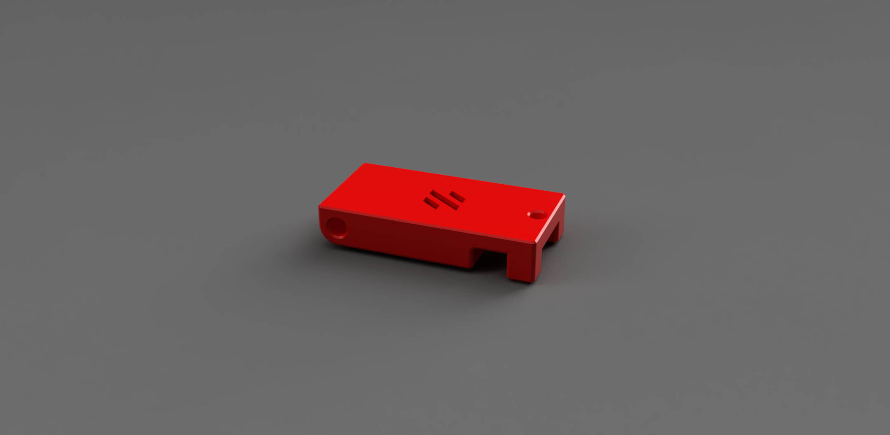
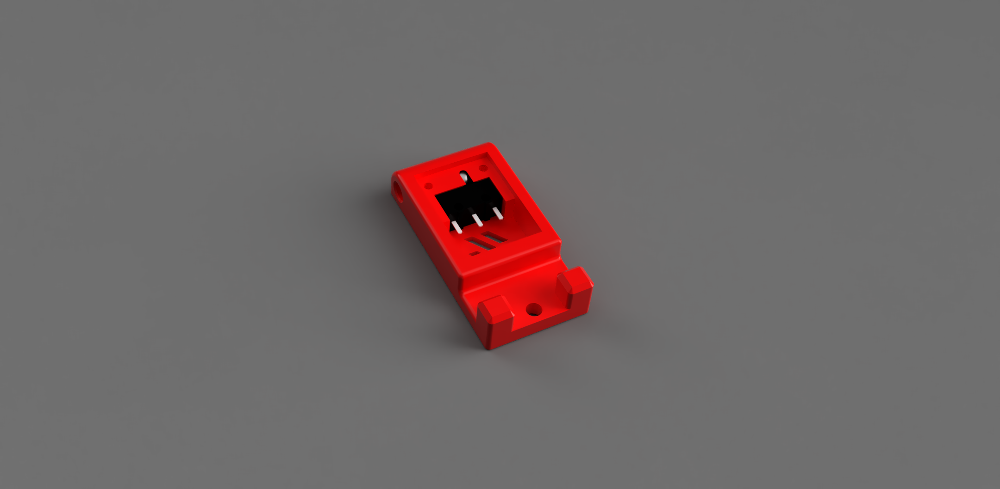
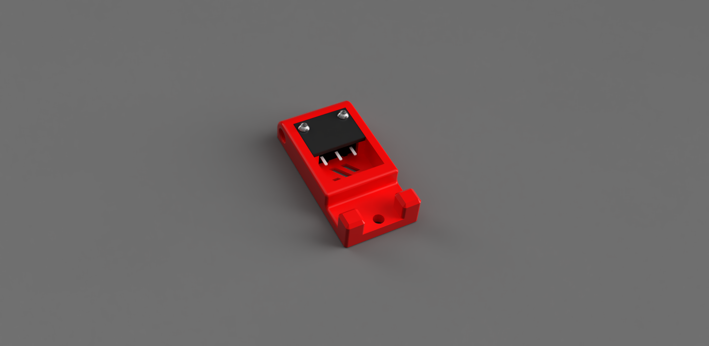

# KlickOut Filament Runout Sensor (Voron 2.4)



## Product Info
This is the KlickOut filament sensor, originally designed based on the Voron 2.4 bowden clip retainer.  It will also work for machines with 2020 extrusions.  The entire BOM, besides of the two printed parts, consists of:

- 2x 2M x 6mm button hex head screws.
- 1x Omron D2F type switch
- 1x 5.5mm steel ball bearing

To attach the clip to the extrusion you will need:

- 1x 3M cap head screw
- 1x 3M T-Nut insert

## Mechanism

 

The mechanism consists of one Omron 2DF type microswitch, and one 5.5mm ball bearing.



 Two 2M x 6mm button head screws are used to retain and capture the ball bearing and the microswitch.
 
  
 
 
## Klipper Configuration Example

You will have to adjust the switch_pin depending on how it is wired, and the type of board you have running on your machine.  Here it assumes a BTT Octopus board.

```toml
# Voron 2.4, BTT Octopus v1.1
[filament_switch_sensor RunoutSensor]
pause_on_runout: False
runout_gcode: PAUSE
#insert_gcode: RESUME
switch_pin: ^PG11
```
